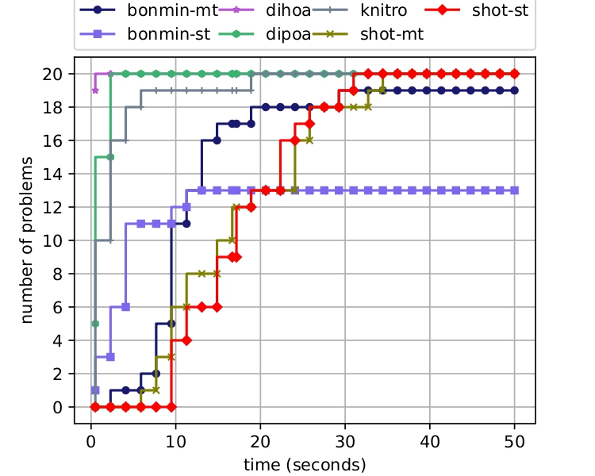
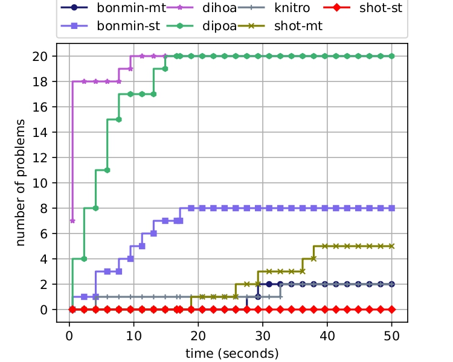
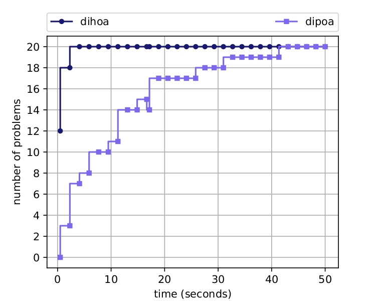

# Sparse Convex Optimization Toolkit (SCOT)

**SCOT** is an open-source distributed optimization solver designed to tackle Sparse Convex Optimization (SCO) problems
within computational networks.

## Overview

**SCOT** can be employed both as a standalone executable application and as a Python API known as SCOTPY, offering
flexibility in integrating it into your projects.

## Key Features

- Solve Sparse Convex Optimization problems with ease.
- Utilize **SCOT** via its Python API, SCOTPY.
- Distribute optimization tasks efficiently across computational networks.
- Compatible with various optimization algorithms for diverse problem domains.
- Easily customizable and extensible for specific use cases.

## Installation

See [```INSTALL```](./INSTALL.md) file.

## Usage

SCOT MPI Command-Line Interface (SMCLI) can be employed to utilize SCOT as a solver, provided appropriate input files
in ```.dist.json``` format are available.

### Example: Distributed Sparse Logistic Regression (DSLogR)

Here's how to solve a DSLogR problem using the ```SMCLI``` interface:

1. Prepare problem data for each node in ```JSON``` format. Assuming two nodes, name the JSON files following this
   convention:

```commandline
node_{mpi_rank}_{problem_name}.dist.json
```

For two nodes and the problem name ```logistic_regression```, the files should be named as:

```commandline
1. node_{0}_{logistic_regression}.dist.json
2. node_{1}_{logistic_regression}.dist.json
```

The exact ```JSON``` format for these files can be found in the ``data`` folder.

2. Execute ```SCOT``` with default settings:

```commandline
mpirun -n 2 ./bin/scot --dir=/path/to/.dist.json/files --input=logistic_regression --nz=2 
```

3. After successful execution, two output files will be created in the ```scot_framework``` folder:

```commandline
1. rank_0_output.json
2. rank_1_output.json
```

These files contain essential information about the solution to the given problem.

## Numerical Benchmarks

### Small scale instances



### Medium scale instances



### Large scale instances



## Publications

1. A. Olama, *A Distributed Framework for Sparse Convex Optimization: Algorithms and Tools.* PhD thesis,
   Federal University of Santa Catarina (UFSC), Brazil, 2023.
2. A. Olama, E. Camponogara, and J. Kronqvist, *Sparse convex optimization toolkit: a mixed-integer framework,*
   Optimization Methods and Software, pp. 1–27, 2023.
3. Olama, E. Camponogara, and P. R. Mendes, *Distributed primal outer approximation algorithm for sparse
   convex programming with separable structures,* Journal of Global Optimization, vol. 86, no. 3, pp. 637–670, 2023.
4. A. Olama, N. Bastianello, P. R. Mendes, and E. Camponogara, *Relaxed hybrid consensus ADMM for distributed convex
   optimisation with coupling constraints,* IET Control Theory & Applications, vol. 13, no. 17, pp. 2828–2837, 2019.

## Acknowledgement
This work is part of the project “Distributed Optimization for Cooperative Machine Learning in Complex Networks” (No PGR10067) which has received
funding from Fundacao de Amparo a Pesquisa e Inovacao do Estado de Santa Catarina (FAPESC), in Brazil, under grant 2021TR2265 and the Ministero degli Affari Esteri e della Cooperazione Internazionale (MAECI), in Italy. Technical support from Digital Futures at KTH and C3.ai Digital Transformation Institute for the project "AI Techniques for Power Systems Under Cyberattacks" is also gratefully acknowledged. 
